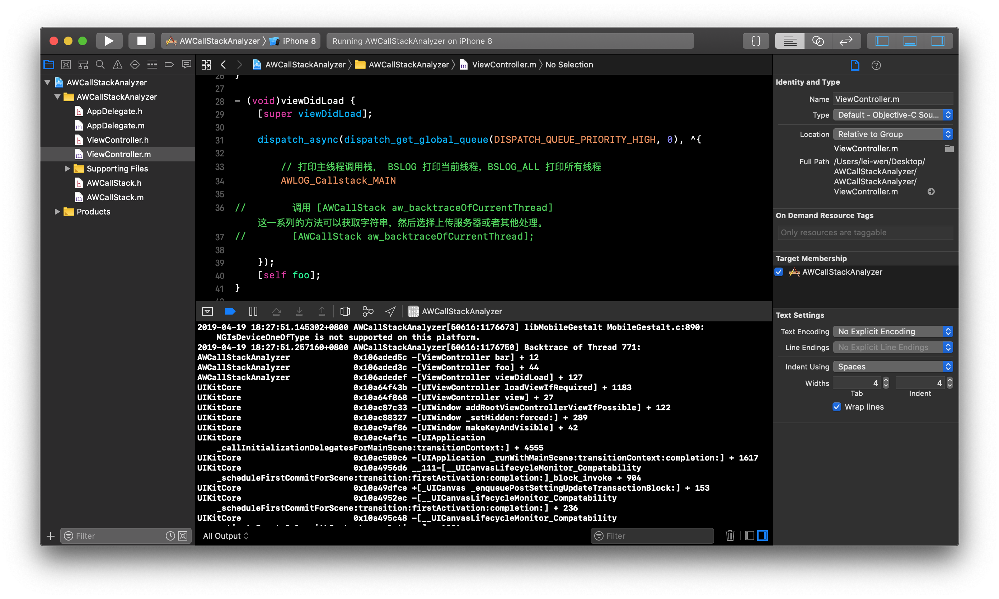

# AWCallStackAnalyzer —— 轻量级调用栈分析器

这是一个强大且轻量的线程调用栈分析器，只有一个类，四百行代码。它支持现有所有模拟器、真机的 CPU 架构，可以获取任意线程的调用栈，因此可以在检测到 runloop 检测到卡顿时获取卡顿处的代码执行情况。

## 用法
``` objc
#import "AWCallStack.h"

- (void)viewDidLoad {
    [super viewDidLoad];

    dispatch_async(dispatch_get_global_queue(DISPATCH_QUEUE_PRIORITY_HIGH, 0), ^{

        // 打印主线程调用栈， BSLOG 打印当前线程，BSLOG_ALL 打印所有线程
        AWLOG_Callstack_MAIN

    });
    [self foo];
}
```
定义了三个宏用于快速输出:
```objc
#define AWLOG_Callstack_Current     NSLog(@"%@",[AWCallStack aw_backtraceOfCurrentThread]);
#define AWLOG_Callstack_MAIN       NSLog(@"%@",[AWCallStack aw_backtraceOfMainThread]);
#define AWLOG_Callstack_ALL       NSLog(@"%@",[AWCallStack aw_backtraceOfAllThread]);
```
或者调用 `[AWCallStack aw_backtraceOfCurrentThread]` 等函数获取字符串格式的调用栈。

## 样例
上述代码中，`AWLOG_Callstack_MAIN` 这个宏的输出结果如下:


## 说明
Xcode 的调试输出不稳定，有时候存在调用 `NSLog()` 但没有输出结果的情况，建议前往 **控制台** 中根据设备的 UUID 查看完整输出。

真机调试和使用 Release 模式时，为了优化，某些符号表并不在内存中，而是存储在磁盘上的 dSYM 文件中，无法在运行时解析，因此符号名称显示为 `<redacted>`。
